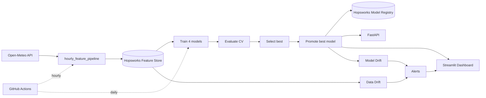

# 🌫️ Islamabad AQI Forecasting System

An end-to-end **MLOps system** that forecasts **PM2.5 air quality** for Islamabad, Pakistan.
It ingests weather + air-quality data, engineers time-series features, trains and compares
four ML models, serves predictions via an API and a dashboard, and runs automated
data/model **drift monitoring** — all orchestrated on a schedule with **GitHub Actions** and
backed by a **Hopsworks** feature store + model registry.

> **Scope note:** The 3-day output is currently a *hindcast* (it scores the most recent
> 72 feature rows), not a true forward forecast.

---

## 🏗️ Architecture



> Design principle: code in Git · features in Hopsworks Feature Store · models in Hopsworks Model Registry · CI is stateless.

---

## ✨ Key Features

- **Hourly feature pipeline** — Open-Meteo ingestion, lag/rolling/time feature engineering, feature-store upsert
- **Daily training pipeline** — trains 4 models, leakage-free TimeSeriesSplit CV, auto-selects and promotes the best
- **Contract-driven inference** — every model carries a `feature_config.json`
- **Drift monitoring** — KS + PSI data drift, baseline-relative model drift with rolling history
- **Two surfaces** — a 5-page Streamlit dashboard and a 6-endpoint FastAPI service
- **Full automation** — both pipelines scheduled on GitHub Actions

---

## 🧰 Tech Stack

| Layer | Tools |
|---|---|
| Data | Open-Meteo API, pandas, pyarrow |
| ML | scikit-learn, XGBoost, LightGBM |
| Feature store / registry | Hopsworks |
| Serving | FastAPI, Streamlit |
| MLOps | GitHub Actions, python-dotenv |

---

## 📂 Project Structure
aqi-predictor/
├── data/processed/          # gitignored — restored from Hopsworks
├── models/
│   ├── best_model/          # promoted model + scaler + feature_config.json
│   ├── saved_models/        # per-model artifacts
│   └── *.json               # comparison metadata
├── reports/drift/           # drift + alert reports
├── src/
│   ├── data_pipeline/
│   ├── feature_engineering/
│   ├── training/
│   ├── inference/
│   ├── monitoring/
│   ├── api/
│   ├── dashboard/
│   └── automation/
├── .github/workflows/
└── requirements.txt

---

## 🤖 Models & Selection

| Model | Notes |
|---|---|
| Ridge | scaled, alpha tuned via inner CV |
| Random Forest | depth-limited, subsampled |
| XGBoost | early stopping, regularized |
| LightGBM | early stopping, regularized |

Selection metric: smallest train↔validation R² gap, tie-broken by highest CV validation R².

---

## 🚀 Setup

```bash
git clone https://github.com/nikhatraghna/aqi-predictor.git
cd aqi-predictor
pip install -r requirements.txt
```

Add credentials to `.env`:
HOPSWORKS_API_KEY=your_key
HOPSWORKS_PROJECT=your_project

---

## ▶️ Usage

```bash
# Ingest latest hour
python -m src.automation.hourly_feature_pipeline

# Daily training loop
python -m src.automation.daily_training_pipeline

# Dashboard
streamlit run src/dashboard/Home.py

# API
uvicorn src.api.fastapi_app:app --reload
```

---

## 📡 Monitoring

- **Data drift** — KS test + PSI per feature
- **Model drift** — current RMSE vs baseline; ≥20% WARNING, ≥40% DRIFT
- **Alerts** — aggregates both with `retrain_recommended` flag

---

## ⚙️ Automation

| Workflow | Schedule | Action |
|---|---|---|
| feature_pipeline.yml | hourly | restore → append → upload to feature store |
| training_pipeline.yml | daily | retrain → promote → forecast → monitor → upload to registry |

---

## 🗺️ Roadmap

- True multi-step forecasting
- Multi-city support (Rawalpindi, Lahore, Karachi)
- Retraining automation wired to monitoring alerts
