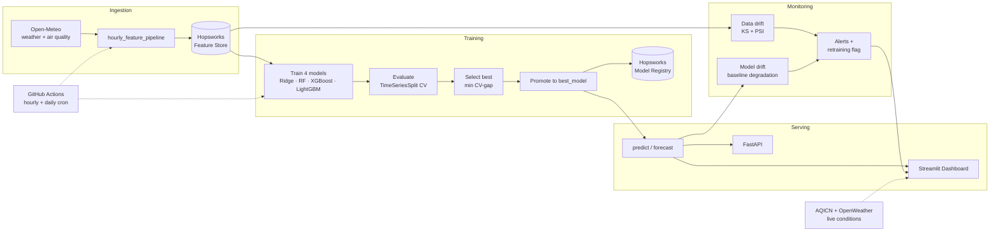

# 🌫️ Islamabad AQI Forecasting System

An end-to-end **MLOps system** that forecasts **PM2.5 air quality** for Islamabad, Pakistan.
It ingests weather + air-quality data, engineers time-series features, trains and compares
four ML models, serves predictions via an API and a dashboard, and runs automated
data/model **drift monitoring** — all orchestrated on a schedule with **GitHub Actions** and
backed by a **Hopsworks** feature store + model registry.

> **Scope note:** The 3-day output is currently a *hindcast* (it scores the most recent
> 72 feature rows), not a true forward forecast. True multi-step forecasting (forward-knowable
> features + a weather-forecast feed) is documented under [Roadmap](#-roadmap).

---

## 🏗️ Architecture



> **Design principle:** code lives in Git; features live in the Hopsworks Feature Store;
> models live in the Hopsworks Model Registry. CI is stateless and reproduces state from Hopsworks.

---

## ✨ Key Features

- **Hourly feature pipeline** — Open-Meteo ingestion, lag/rolling/time feature engineering, feature-store upsert.
- **Daily training pipeline** — trains 4 models, leakage-free TimeSeriesSplit CV, anti-overfit configs, auto-selects + promotes the best.
- **Contract-driven inference** — every model carries a `feature_config.json` (features, scaling flag, metrics), so swapping the winning model needs zero code changes.
- **Drift monitoring** — KS + PSI data drift, baseline-relative model drift with rolling history, aggregated alerts + a retraining-readiness flag.
- **Two surfaces** — a 5-page Streamlit dashboard and a 6-endpoint FastAPI service.
- **Full automation** — both pipelines scheduled on GitHub Actions.

---

## 🧰 Tech Stack

| Layer | Tools |
|---|---|
| Data | Open-Meteo API, AQICN, OpenWeather, pandas, pyarrow |
| ML | scikit-learn, XGBoost, LightGBM |
| Feature store / registry | Hopsworks |
| Explainability | SHAP, model feature importances |
| Serving | FastAPI, Streamlit, Altair |
| MLOps | GitHub Actions, python-dotenv |

---

## 📂 Project Structure
aqi-predictor/
├── data/processed/          # engineered features (gitignored — restored from Hopsworks)
├── models/
│   ├── best_model/          # promoted model + scaler + feature_config.json
│   ├── saved_models/        # per-model artifacts
│   └── \*.json              # comparison + best-model metadata
├── reports/drift/           # data/model drift + alert reports
├── src/
│   ├── data_pipeline/       # historical + realtime ingestion
│   ├── feature_engineering/ # feature creation + selection
│   ├── feature_store/       # Hopsworks connection + upload
│   ├── training/            # train_\*, evaluate, select_best
│   ├── models/              # registry upload/download
│   ├── inference/           # load_model, predict, forecast_next_3_days
│   ├── monitoring/          # data_drift, model_drift, alerts
│   ├── api/                 # fastapi_app
│   ├── dashboard/           # Streamlit Home + pages/
│   └── automation/          # hourly_feature_pipeline, daily_training_pipeline
├── .github/workflows/       # feature_pipeline.yml, training_pipeline.yml
└── requirements.txt

---

## 🤖 Models & Selection

Four models are trained and compared on a chronological train/val/test split (70/15/15)
with nested feature selection inside a 3-fold TimeSeriesSplit (no leakage):

| Model | Notes |
|---|---|
| Ridge | scaled, alpha tuned via inner CV |
| Random Forest | depth-limited, subsampled |
| XGBoost | early stopping on val set, L1+L2 regularized |
| LightGBM | early stopping, regularized |

**Selection metric:** smallest train↔validation R² gap (most stable generalization),
tie-broken by highest CV validation R². The winner is promoted to `models/best_model/`
with its inference contract and uploaded to the Hopsworks Model Registry.

**Overfitting check:** R² gap ≤ 0.05 = healthy. Test/train RMSE ratio < 1.3 = good generalization.

---

## 🚀 Setup

### 1. Clone & install

```bash
git clone https://github.com/nikhatraghna/aqi-predictor.git
cd aqi-predictor
pip install -r requirements.txt
pip install streamlit altair shap
```

### 2. Configure credentials (`.env` — never commit this)

Create a `.env` file in the repo root (a template is in `.env.example`):
HOPSWORKS_API_KEY=your_hopsworks_api_key_here
HOPSWORKS_PROJECT=your_hopsworks_project_name
AQICN_API_KEY=your_aqicn_token_here
OPENWEATHER_API_KEY=your_openweather_key_here
CITY=Islamabad

- **Hopsworks** (required): create a free project at [hopsworks.ai](https://hopsworks.ai) and generate an API key.
- **AQICN / OpenWeather** (optional): only power the dashboard's live conditions panel; the model uses Open-Meteo (no key needed).
- In GitHub Actions, store `HOPSWORKS_API_KEY` and `HOPSWORKS_PROJECT` as Repository Secrets — never in the repo.

---

## ▶️ Usage

```bash
# Ingest the latest hour into the feature store
python -m src.automation.hourly_feature_pipeline

# Full daily loop: train → evaluate → promote → forecast → monitor → register
python -m src.automation.daily_training_pipeline

# Inference only
python -m src.inference.forecast_next_3_days

# Monitoring
python -m src.monitoring.data_drift
python -m src.monitoring.model_drift
python -m src.monitoring.alerts

# Dashboard
streamlit run src/dashboard/Home.py

# API (Swagger UI at http://localhost:8000/docs)
uvicorn src.api.fastapi_app:app --reload
```

### API endpoints

| Method | Path | Description |
|---|---|---|
| GET | `/` | health + loaded model |
| GET | `/model` | model name, metrics, features |
| GET | `/forecast` | latest 3-day PM2.5 forecast |
| POST | `/predict` | predict for supplied feature rows |
| GET | `/monitoring` | latest drift / alert status |
| GET | `/live` | live AQICN + OpenWeather snapshot |

---

## 📡 Monitoring

- **Data drift** — KS test + PSI per feature; flagged DRIFT only when both agree (PSI ≥ 0.2 and KS p-value < 0.05).
- **Model drift** — current RMSE vs baseline; ≥20% → WARNING, ≥40% → DRIFT; rolling history saved.
- **Alerts** — aggregates both into an overall status and a `retrain_recommended` flag.

---

## ⚙️ Automation (GitHub Actions)

| Workflow | Schedule | Action |
|---|---|---|
| `feature_pipeline.yml` | hourly | restore → append latest hour → upload to feature store |
| `training_pipeline.yml` | daily | refresh → retrain → promote → forecast → monitor → register |

Both are stateless — they restore state from Hopsworks at the start.

---

## 🗺️ Roadmap

- **True multi-step forecasting** — recursive lags + future weather from a forecast API.
- **Multi-city support** — Rawalpindi, Lahore, Karachi.
- **Hosted dashboard** reading directly from Hopsworks.
- **Retraining automation** wired to the `retrain_recommended` flag.

---

## 📝 Design Notes

- **Source consistency:** model trained and served on Open-Meteo data; AQICN/OpenWeather for live panel only.
- **Feature store as source of truth:** CI restores features from Hopsworks — no parquet files in Git.
- **Honest evaluation:** leakage-free nested CV, R² gap overfitting check, clearly-labeled hindcast.
